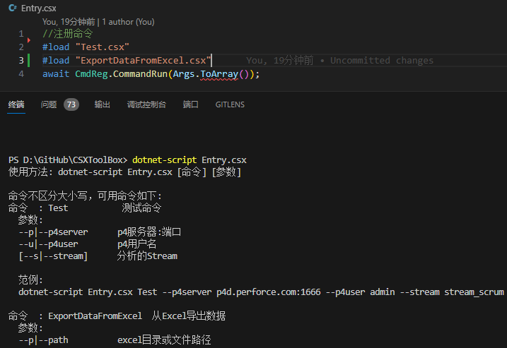
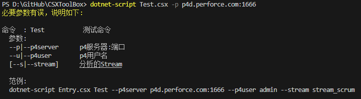

# C#脚本命令框架
非常适合统一Unity项目的工具语言，也可通过宏和项目共用代码(参考ExportDataFromExcel.csx)。即改即用，不用重新发布。

# 环境

- 安装：需要依赖 net7.0 的 `dotnet script`，用其他版本会在发布时会报错 `dotnet publish failed with result '1'`。
  - `dotnet tool install dotnet-script --version 1.5.0 --framework net7.0 -g`
- 卸载
  - `dotnet tool uninstall dotnet-script -g`
- 查看 `dotnet-script` 依赖的 net 版本
  - `dotnet-script --info`
- 自动完成
  - 依赖 `omnisharp.json` 中的 `defaultTargetFramework`。
- 调试
  - 依赖 `launch.json` 的配置。

# 发布

- 发布为 exe (exe 文件包含所有依赖库) : `dotnet-script publish Entry.csx`
- 发布为 dll : `dotnet-script publish Entry.csx --dll`
- 可使用 -n 参数命名发布文件 : `dotnet-script publish Entry.csx -n ProjTools`
- 其它发布参数可参考[链接](https://github.com/dotnet-script/dotnet-script)。

# 执行模式

- 脚本执行，注意第二种方式的命令名实际上是文件名:
  - 通过入口脚本执行: `dotnet-script Entry.csx CommandName -paramName1 paramValue1 -paramName2 paramValue2`
  - 直接执行脚本: `dotnet-script path_to_command.csx -paramName1 paramValue1 -paramName2 paramValue2`
- 发布后执行 (假设发布为 `Entry.exe`):
  - `Entry.exe CommandName -paramName1 paramValue1 -paramName2 paramValue2`

# 其他说明

- 在 `Entry.csx` 中使用 `#load xx.csx` 注册命令后，运行 `Entry.exe` 或 `dotnet-script Entry.csx` 可以列出所有注册过的命令及其参数说明。
- 
- 命令脚本末尾需要调用 `CmdReg.CommandRun` 才能被正确调用。否则需要在脚本末尾写显示代码进行调用。
- 命令参数错误时会自动提示。
- 
